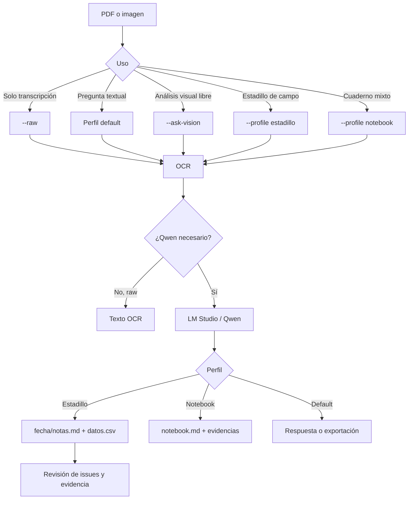

# Unlimited OCR Agent

Digitalización local y trazable de PDF e imágenes con Unlimited-OCR y un modelo Qwen servido por LM Studio. El perfil `estadillo` convierte cada jornada en una entrega revisable equivalente a [`gt/`](gt/):

```text
output_ocr/
└── 2026-05-06/
    ├── notas.md
    ├── datos.csv
    ├── document.json
    ├── pages/
    ├── raw/
    ├── assets/
    └── review/
```

`notas.md` conserva los metadatos y enlaza explícitamente `datos.csv`. El CSV contiene una fila por registro. La convención y la [guía de análisis con Qwen](docs/QWEN_ANALYSIS_GUIDE.md) permiten relacionar ambos artefactos y comparar varias fechas sin inventar tendencias, causalidad ni datos ausentes.

## Requisitos

- Windows o Linux con Python 3.11 y [uv](https://docs.astral.sh/uv/).
- Git.
- GPU NVIDIA compatible con PyTorch/CUDA para Unlimited-OCR.
- LM Studio con su servidor OpenAI-compatible en `http://localhost:1234`.
- Un Qwen multimodal cargado en LM Studio. El modelo se selecciona por identificador; no está codificado de forma fija.

## Instalación reproducible

```powershell
git clone <URL_DEL_REPOSITORIO>
cd unlimited_ocr_agent
uv venv --python 3.11
.\.venv\Scripts\python.exe setup_env.py
```

En Linux, sustituye el intérprete por `.venv/bin/python`. Comprueba la instalación sin GPU ni servidor:

```powershell
.\.venv\Scripts\python.exe -m unittest discover -s tests
.\.venv\Scripts\python.exe scripts\projectctl.py validate
```

Configura LM Studio:

```powershell
$env:LM_STUDIO_URL = "http://localhost:1234"
$env:LM_STUDIO_API_KEY = "lm-studio"
$env:LM_STUDIO_VISION_MODEL = "identificador-del-qwen-multimodal"
$env:LM_STUDIO_TEXT_MODEL = "identificador-del-qwen"
```

Puedes pasar el modelo directamente con `--vision-model`. Usa exactamente el identificador que expone LM Studio.

## Modos de uso

### Estadillo — entrega recomendada

```powershell
.\.venv\Scripts\python.exe agent.py 26-05-06.pdf --profile estadillo --vision-model "identificador-del-qwen-multimodal" --output output_ocr
```

Produce `<fecha>/notas.md` y `<fecha>/datos.csv`. Si la fecha no está respaldada de forma inequívoca, conserva un directorio seguro basado en el archivo y registra `SESSION_DATE_UNRESOLVED` para revisión humana.

### OCR directo

```powershell
.\.venv\Scripts\python.exe agent.py documento.pdf --raw --output output_ocr
```

Extrae texto sin consultar a Qwen.

### Consulta general

```powershell
.\.venv\Scripts\python.exe agent.py documento.pdf "Extrae los hechos presentes" --text-model "identificador-del-qwen"
```

### Visión general

```powershell
.\.venv\Scripts\python.exe agent.py documento.pdf "Describe la estructura" --ask-vision --vision-model "identificador-del-qwen-multimodal"
```

### Cuaderno heterogéneo

```powershell
.\.venv\Scripts\python.exe agent.py documento.pdf --profile notebook --vision-model "identificador-del-qwen-multimodal" --output output_ocr
```

El perfil `notebook` mantiene su salida `notebook.md` para documentos mixtos; no sustituye el contrato específico de estadillo.

## Flujo de decisión



El modo OCR `worker` es el predeterminado y aísla Unlimited-OCR para liberar VRAM antes de consultar Qwen. `--ocr-mode in_process` reduce el coste de arranque, pero puede aumentar el riesgo de falta de memoria.

## Contrato del estadillo

La fuente normativa es [`AGENTS.md`](AGENTS.md), y [`gt/`](gt/) es la referencia humana de forma, no una plantilla de valores.

- No se inventan campos.
- La carpeta usa una fecha ISO demostrada por el documento.
- `notas.md` contiene YAML con objetivo, fecha, asistentes, equipamiento, situación atmosférica, catálogo de especies y enlace relativo al CSV.
- `datos.csv` usa exactamente `id,col,fil,especie,altura_cm,foto,bbch,observaciones`.
- Solo se normalizan las variantes explícitas `Ap→P`, `Ah→H`, `Ar→R` y `Mz→M`.
- `document.json`, `raw/`, `pages/` y `review/` mantienen la trazabilidad.
- Las comparaciones entre fechas deben distinguir hechos observados de inferencias y señalar discontinuidades o ambigüedades.

## Validación y diagnóstico

```powershell
.\.venv\Scripts\python.exe -m unittest discover -s tests
.\.venv\Scripts\python.exe -m compileall -q agent.py src tests
.\.venv\Scripts\python.exe scripts\projectctl.py validate
git diff --check
```

La prueba real con GPU, Unlimited-OCR y LM Studio es optativa:

```powershell
$env:RUN_ESTADILLO_INTEGRATION = "1"
.\.venv\Scripts\python.exe -m unittest tests.test_profile_estadillo.TestRealEstadilloProfileIntegration
```

Revisa siempre `review/issues.json` antes de considerar definitiva una digitalización. Los conflictos de cabecera, especies desconocidas, fechas no resueltas y regiones ambiguas requieren validación humana.

## Estructura del repositorio

- `src/fieldnotes/`: aplicación, perfiles, esquemas, OCR, VLM, renderizado y revisión.
- `tests/`: pruebas unitarias portables y fixtures.
- `gt/`: resultado revisado usado como referencia de aceptación.
- `docs/`: arquitectura, arranque, decisiones, riesgos y planificación.
- `.ai/`, `.gemini/`, `scripts/projectctl.py`: control y trazabilidad del proyecto.
- `jarvis/`: referencia local ignorada; no forma parte del producto ni se modifica.

## Privacidad y límites

El flujo es local mientras LM Studio y los modelos también lo sean. No se envían documentos a servicios externos desde la aplicación. La calidad final depende de la legibilidad, del modelo cargado y de la revisión humana: Qwen puede vincular archivos por fecha y esquema, pero esa capacidad no convierte inferencias en evidencia.
