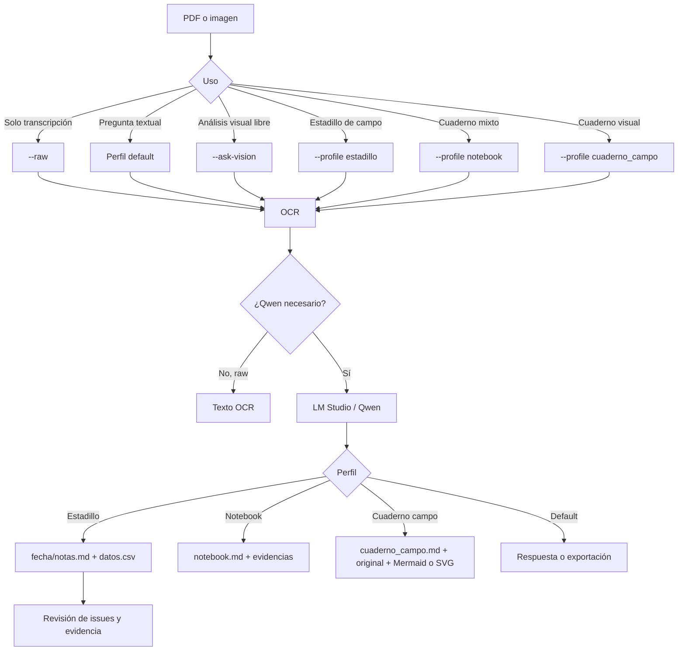

# Unlimited OCR Agent

Digitalización local y trazable de PDF e imágenes con Unlimited-OCR y un modelo Qwen servido por LM Studio. El perfil `estadillo` convierte cada jornada en una entrega revisable equivalente a [`gt/`](gt/):

```text
output_ocr/
└── 2026-05-06/
    ├── notas.md
    ├── datos.csv
    ├── document.json
    ├── pages/
    ├── raw/
    ├── assets/
    └── review/
```

`notas.md` conserva los metadatos y enlaza explícitamente `datos.csv`. El CSV contiene una fila por registro. La convención y la [guía de análisis con Qwen](docs/QWEN_ANALYSIS_GUIDE.md) permiten relacionar ambos artefactos y comparar varias fechas sin inventar tendencias, causalidad ni datos ausentes.

## Inicio rápido

Para instalación, validación, ejecución, revisión y supervisión de recursos, consulta el [manual paso a paso](docs/BOOTSTRAP.md).

## Requisitos

- Windows o Linux con Python 3.11 y [uv](https://docs.astral.sh/uv/).
- Git.
- GPU NVIDIA compatible con PyTorch/CUDA para Unlimited-OCR.
- LM Studio con su servidor OpenAI-compatible en `http://localhost:1234`.
- Un Qwen multimodal cargado en LM Studio. El modelo se selecciona por identificador; no está codificado de forma fija.

## Instalación reproducible

```powershell
git clone https://github.com/imchrisrueda/unlimited_ocr_agent.git
cd unlimited_ocr_agent
git switch codex/pr1-safe-refactor
uv venv --python 3.11
.\.venv\Scripts\python.exe setup_env.py
```

En Linux, sustituye el intérprete por `.venv/bin/python`. Comprueba la instalación sin GPU ni servidor:

```powershell
.\.venv\Scripts\python.exe -m unittest discover -s tests
.\.venv\Scripts\python.exe scripts\projectctl.py validate
```

Configura LM Studio:

```powershell
$env:LM_STUDIO_URL = "http://localhost:1234"
$env:LM_STUDIO_API_KEY = "lm-studio"
$env:LM_STUDIO_VISION_MODEL = "identificador-del-qwen-multimodal"
$env:LM_STUDIO_TEXT_MODEL = "identificador-del-qwen"
```
`identificador-del-qwen-multimodal` e `identificador-del-qwen` son marcadores: no los copies literalmente. El modelo de visión debe estar cargado en LM Studio y aceptar imágenes. Por ejemplo, si LM Studio anuncia `qwen/qwen3.5-9b` como modelo multimodal, configúralo así:

```powershell
$env:LM_STUDIO_VISION_MODEL = "qwen/qwen3.5-9b"
$env:LM_STUDIO_TEXT_MODEL = "qwen/qwen3.8-27b"
```

Los identificadores disponibles dependen de los modelos cargados localmente. Si el configurado no aparece, la aplicación mostrará los identificadores anunciados. Carga un modelo Qwen-VL/multimodal y usa su identificador exacto.

Puedes pasar el modelo directamente con `--vision-model`. Usa exactamente el identificador que expone LM Studio.

## Modos de uso

### Estadillo — entrega recomendada

```powershell
.\.venv\Scripts\python.exe agent.py 26-05-06.pdf --profile estadillo --vision-model "identificador-del-qwen-multimodal" --output output_ocr
```

Genera la entrega canónica `<fecha>/notas.md` y `<fecha>/datos.csv`, y el libro de revisión `<fecha>/review/datos.xlsx`. Si la fecha no está respaldada de forma inequívoca, conserva un directorio seguro basado en el archivo y registra `SESSION_DATE_UNRESOLVED`.

Para revisar en Excel:

1. Abre `review/datos.xlsx` y corrige los registros.
2. Guarda el libro con el mismo nombre.
3. Publica los cambios en los artefactos de datos:

```powershell
.\.venv\Scripts\python.exe scripts\publish_estadillo_excel.py output_ocr\2026-05-06
```

El comando valida la cabecera, las coordenadas, especies y BBCH. Acepta coma o punto en `altura_cm` y actualiza `datos.csv` (UTF-8, comas y punto decimal) y `document.json`, preservando el orden y la página de origen de cada registro. Si cambia el número u orden de las filas, o encuentra un valor inválido, no publica nada.

### OCR directo

```powershell
.\.venv\Scripts\python.exe agent.py documento.pdf --raw --output output_ocr
```

Extrae texto sin consultar a Qwen.

### Consulta general

```powershell
.\.venv\Scripts\python.exe agent.py documento.pdf "Extrae los hechos presentes" --text-model "identificador-del-qwen"
```

Es una respuesta interpretativa; no la uses como entrega canónica ni para completar datos ausentes. Para digitalización trazable usa --profile estadillo.

### Visión general

```powershell
.\.venv\Scripts\python.exe agent.py documento.pdf "Describe la estructura" --ask-vision --vision-model "identificador-del-qwen-multimodal"
```

### Cuaderno heterogéneo

```powershell
.\.venv\Scripts\python.exe agent.py documento.pdf --profile notebook --vision-model "identificador-del-qwen-multimodal" --output output_ocr
```

El perfil `notebook` mantiene su salida `notebook.md` para documentos mixtos; no sustituye el contrato específico de estadillo.

Para cuadernos visuales usa `--profile cuaderno_campo`: genera `cuaderno_campo.md` en orden de página, sin tablas de estadillo. Cada figura se reconstruye con el VLM; los flujos se incluyen como Mermaid y después se inserta la imagen original.

```powershell
.\.venv\Scripts\python.exe agent.py documento.pdf --profile cuaderno_campo --vision-model "identificador-del-qwen-multimodal" --output output_ocr
```

La extracción textual y la extracción de figuras se ejecutan en pasadas VLM separadas. Si una referencia visual es inválida, se descarta y queda advertida; nunca se crea una entidad para repararla.

## Flujo de decisión



El modo OCR `worker` es el predeterminado y aísla Unlimited-OCR para liberar VRAM antes de consultar Qwen. `--ocr-mode in_process` reduce el coste de arranque, pero puede aumentar el riesgo de falta de memoria.

## Contrato del estadillo

La fuente normativa es [`AGENTS.md`](AGENTS.md), y [`gt/`](gt/) es la referencia humana de forma, no una plantilla de valores.

- No se inventan campos.
- La carpeta usa una fecha ISO demostrada por el documento.
- `notas.md` contiene YAML con objetivo, fecha, asistentes, equipamiento, situación atmosférica, catálogo de especies y enlace relativo al CSV.
- `datos.csv` usa exactamente `id,col,fil,especie,altura_cm,foto,bbch,observaciones`.
- Solo se normalizan las variantes explícitas `Ap→P`, `Ah→H`, `Ar→R` y `Mz→M`.
- `document.json`, `raw/`, `pages/` y `review/` mantienen la trazabilidad.
- Las comparaciones entre fechas deben distinguir hechos observados de inferencias y señalar discontinuidades o ambigüedades.

## Validación y diagnóstico

```powershell
.\.venv\Scripts\python.exe -m unittest discover -s tests
.\.venv\Scripts\python.exe -m compileall -q agent.py src tests
.\.venv\Scripts\python.exe scripts\projectctl.py validate
git diff --check
```

### Pruebas de integración real (optativas)

Las pruebas anteriores son locales y no necesitan GPU ni LM Studio. Estas pruebas usan `26-05-06.pdf` y pueden cargar Unlimited-OCR o consultar LM Studio, por lo que se desactivan por defecto.

Antes de ejecutarlas, comprueba que la GPU y el modelo de visión estén disponibles:

```powershell
nvidia-smi
$env:LM_STUDIO_URL = "http://localhost:1234"
$env:LM_STUDIO_API_KEY = "lm-studio"
$env:LM_STUDIO_VISION_MODEL = "identificador-del-qwen-multimodal"
```

Ejecuta cada prueba de forma independiente:

```powershell
# OCR directo: texto, páginas y raw/document.md
$env:RUN_OCR_INTEGRATION = "1"
.\.venv\Scripts\python.exe -m unittest tests.test_ocr.TestRealOCRIntegration

# OCR en worker: aislamiento de Torch, seis páginas y liberación de VRAM
$env:RUN_OCR_WORKER_INTEGRATION = "1"
.\.venv\Scripts\python.exe -m unittest tests.test_ocr.TestRealOCRWorkerIntegration

# Estadillo: estructura canónica, CSV y al menos 50 registros
$env:RUN_ESTADILLO_INTEGRATION = "1"
.\.venv\Scripts\python.exe -m unittest tests.test_profile_estadillo.TestRealEstadilloProfileIntegration

# Revisión de estadillo: issues.json, crops válidos y sin PNG huérfanos
.\.venv\Scripts\python.exe -m unittest tests.test_review.TestRealEstadilloReviewIntegration

# Notebook: estructura y artefactos de notebook.md
$env:RUN_NOTEBOOK_INTEGRATION = "1"
.\.venv\Scripts\python.exe -m unittest tests.test_profile_notebook.TestRealNotebookProfileIntegration

# LM Studio: respuesta visual no vacía
$env:RUN_LMSTUDIO_VISION_INTEGRATION = "1"
.\.venv\Scripts\python.exe -m unittest tests.test_vlm.TestRealLMStudioVisionIntegration

# LM Studio: salida estructurada y evidencia por página
$env:RUN_LMSTUDIO_STRUCTURED_INTEGRATION = "1"
.\.venv\Scripts\python.exe -m unittest tests.test_structured.TestRealLMStudioStructuredIntegration

# Diagrama: marcador de integración, sin verificaciones reales todavía
$env:RUN_DIAGRAM_REAL_INTEGRATION = "1"
.\.venv\Scripts\python.exe -m unittest tests.test_diagram.TestRealDiagramVisionIntegrationOptIn
```

La prueba de diagramas solo comprueba su activación; no certifica la extracción de diagramas. Las pruebas reales generan resultados dependientes del modelo cargado: revisa sus artefactos antes de aceptarlos.

Para validar de extremo a extremo `cuaderno_campo` con documentos propios:

```powershell
.\.venv\Scripts\python.exe agent.py documento_con_diagrama.pdf --profile cuaderno_campo --vision-model $env:LM_STUDIO_VISION_MODEL --output output_ocr
.\.venv\Scripts\python.exe agent.py cuaderno_con_croquis.pdf --profile cuaderno_campo --vision-model $env:LM_STUDIO_VISION_MODEL --output output_ocr
```

Comprueba que `documento_con_diagrama/cuaderno_campo.md` contiene Mermaid, que `cuaderno_con_croquis/cuaderno_campo.md` enlaza el SVG reconstruido y que ambos incorporan `pages/page_001.png`. Estas ejecuciones sí validan el flujo real, pero requieren revisión humana porque el resultado depende del VLM.
### Primera ejecución y supervisión

Tras instalar y superar las pruebas locales, procesa un documento real en una carpeta separada:

```powershell
$env:LM_STUDIO_URL = "http://localhost:1234"
$env:LM_STUDIO_API_KEY = "lm-studio"
$env:LM_STUDIO_VISION_MODEL = "identificador-del-qwen-multimodal"
.\.venv\Scripts\python.exe agent.py documento.pdf --profile estadillo --vision-model $env:LM_STUDIO_VISION_MODEL --output output_ocr
```

La salida debe contener `notas.md`, `datos.csv`, `review/datos.xlsx` y `review/issues.json`. No des por definitiva una digitalización con incidencias: revisa los crops de `review/` y la fuente visual.

Para supervisar una ejecución real en segundo plano, usa un nombre distinto de `$PID`, que es una variable reservada de PowerShell:

```powershell
$logDir = "C:\tmp\ocr-monitor"
New-Item -ItemType Directory -Force -Path $logDir | Out-Null
$run = Start-Process -FilePath ".\.venv\Scripts\python.exe" -ArgumentList "agent.py","documento.pdf","--profile","estadillo","--vision-model",$env:LM_STUDIO_VISION_MODEL,"--output","output_ocr" -PassThru -WindowStyle Hidden -RedirectStandardOutput "$logDir\stdout.log" -RedirectStandardError "$logDir\stderr.log"
$runPid = $run.Id
while (Get-Process -Id $runPid -ErrorAction SilentlyContinue) {
  Get-Process -Id $runPid | Select-Object Id,CPU,WorkingSet64
  nvidia-smi --query-gpu=memory.used,utilization.gpu --format=csv,noheader
  Start-Sleep -Seconds 15
}
Get-Content "$logDir\stderr.log"
```

Al terminar, confirma que no quedan procesos `python.exe` asociados al proyecto y que la VRAM volvió al nivel previo. LM Studio puede permanecer activo: es un servicio independiente.

Revisa siempre `review/issues.json` antes de considerar definitiva una digitalización. Los conflictos de cabecera, especies desconocidas, fechas no resueltas y regiones ambiguas requieren validación humana.

## Estructura del repositorio

- `src/fieldnotes/`: aplicación, perfiles, esquemas, OCR, VLM, renderizado y revisión.
- `tests/`: pruebas unitarias portables y fixtures.
- `gt/`: resultado revisado usado como referencia de aceptación.
- `docs/`: arquitectura, arranque, decisiones, riesgos y planificación.
- `.ai/`, `.gemini/`, `scripts/projectctl.py`: control y trazabilidad del proyecto.
- `jarvis/`: referencia local ignorada; no forma parte del producto ni se modifica.

## Privacidad y límites

El flujo es local mientras LM Studio y los modelos también lo sean. No se envían documentos a servicios externos desde la aplicación. La calidad final depende de la legibilidad, del modelo cargado y de la revisión humana: Qwen puede vincular archivos por fecha y esquema, pero esa capacidad no convierte inferencias en evidencia.
